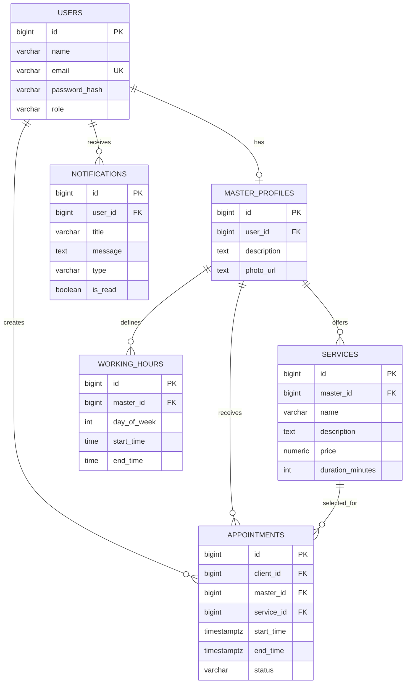

# ER-модель MasterBook

```mermaid
erDiagram
    USERS ||--o| MASTER_PROFILES : has
    MASTER_PROFILES ||--o{ SERVICES : offers
    MASTER_PROFILES ||--o{ WORKING_HOURS : defines
    USERS ||--o{ APPOINTMENTS : creates
    MASTER_PROFILES ||--o{ APPOINTMENTS : receives
    SERVICES ||--o{ APPOINTMENTS : selected_for
    USERS ||--o{ NOTIFICATIONS : receives

    USERS {
        bigint id PK
        varchar name
        varchar email UK
        varchar password_hash
        varchar role
    }

    MASTER_PROFILES {
        bigint id PK
        bigint user_id FK
        text description
        text photo_url
    }

    SERVICES {
        bigint id PK
        bigint master_id FK
        varchar name
        text description
        numeric price
        int duration_minutes
    }

    WORKING_HOURS {
        bigint id PK
        bigint master_id FK
        int day_of_week
        time start_time
        time end_time
    }

    APPOINTMENTS {
        bigint id PK
        bigint client_id FK
        bigint master_id FK
        bigint service_id FK
        timestamptz start_time
        timestamptz end_time
        varchar status
    }

    NOTIFICATIONS {
        bigint id PK
        bigint user_id FK
        varchar title
        text message
        varchar type
        boolean is_read
    }
```
